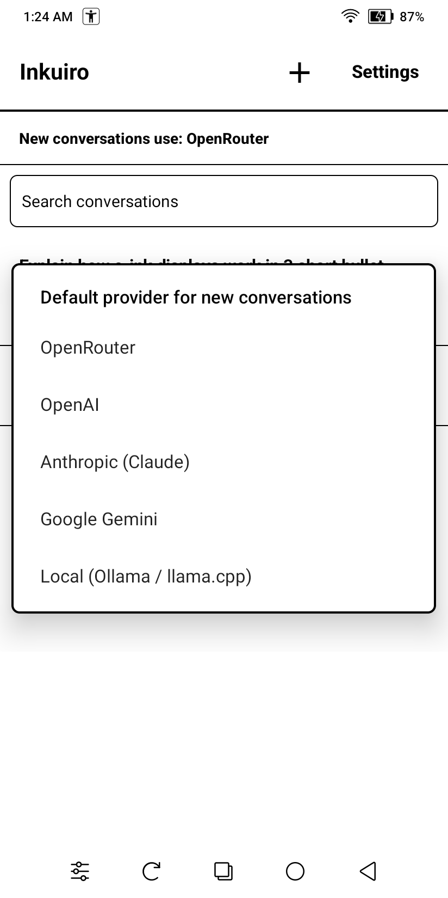
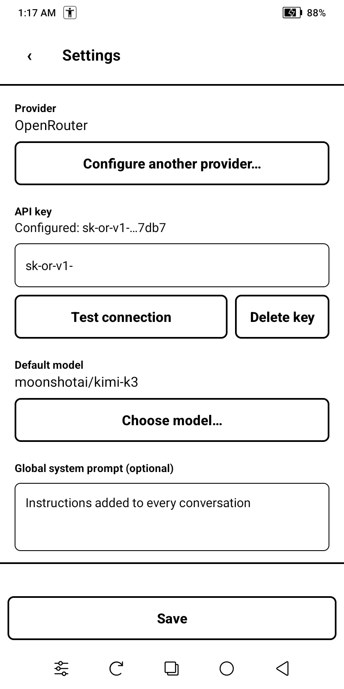
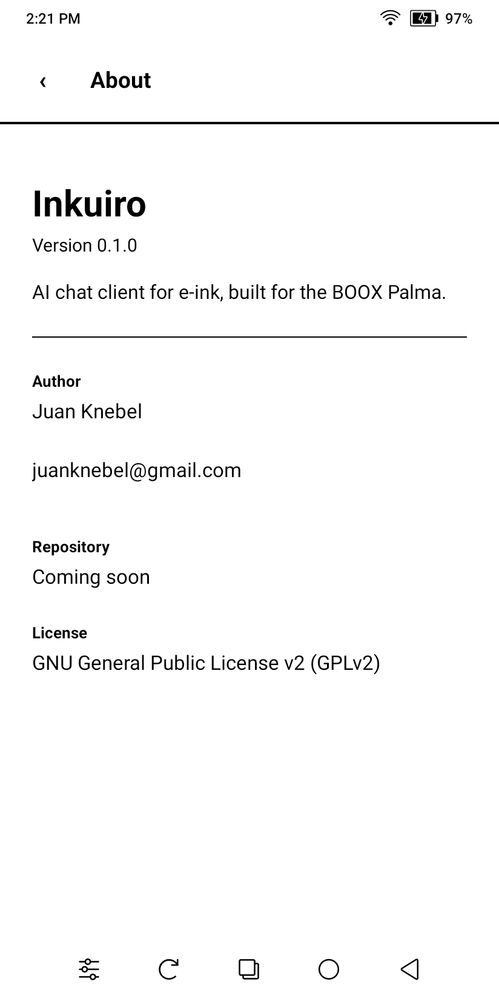

# Inkuiro

A native Android AI chat client built for **e-ink phones** — specifically the
[BOOX Palma / Palma 2](https://shop.boox.com/products/palma). It talks to
multiple AI providers and renders everything with e-ink in mind: no animations,
pure black-and-white contrast, reading by page jumps, and explicit control of
the screen refresh modes through the Onyx SDK.

It's a personal, single-user app.

## Features

- **Multiple providers**: OpenRouter, OpenAI, Anthropic (Claude), Google Gemini,
  and any local OpenAI-compatible server (Ollama, llama.cpp).
- **Per-conversation model & provider** — pick a default provider for new chats
  on the home screen, and change the model of any individual conversation from
  its header.
- **Streaming tuned for e-ink**: responses are coalesced and repainted by
  paragraph (or every ~1.5 s), never token-by-token, to avoid constant flashing.
- **Full Markdown rendering** (code, lists, tables, quotes) into native views —
  no WebView.
- **Local history**: conversations persist offline in a local database; only
  inference needs the network.
- **Secure keys**: API keys are stored encrypted (Android Keystore) and never
  written to logs.
- **Reading built for e-ink**: turn pages with the Palma's physical button,
  the on-screen arrows, or a tap on the top/bottom of the screen — or just
  drag with your finger (inertia is disabled, since it smears on e-ink).
- **Bilingual UI** (English / Spanish) following the system language.

## Screenshots

<p>
  
  &nbsp;
  
  &nbsp;
  
  &nbsp;
  
  &nbsp;
  
</p>

_Captured on a BOOX Palma 2 — the UI is pure black and white for e-ink._

## Requirements

- **JDK 17** (e.g. Temurin / OpenJDK 17).
- **Android SDK** with:
  - Platform `android-34` (compile/target SDK 34, min SDK 30)
  - Build-tools and platform-tools (for `adb`)
- **Gradle** is **not** installed manually — the project ships the Gradle
  Wrapper (`./gradlew`), which downloads the pinned version (8.11.x)
  automatically.

You can get the Android SDK either through Android Studio or the standalone
command-line tools.

## Building

1. **Install JDK 17** and make sure it's the active `java` (set `JAVA_HOME` to
   the JDK 17 home).

2. **Install the Android SDK** and its components:

   ```sh
   sdkmanager "platforms;android-34" "build-tools;34.0.0" "platform-tools"
   ```

   (Or install them from the SDK Manager in Android Studio.)

3. **Point the project at your SDK.** Either export `ANDROID_HOME` to the SDK
   location, or create a `local.properties` file in the repo root:

   ```properties
   sdk.dir=/absolute/path/to/Android/Sdk
   ```

   `local.properties` is git-ignored — it's machine-specific.

4. **Build the debug APK** (the wrapper fetches Gradle and all dependencies on
   the first run):

   ```sh
   ./gradlew assembleDebug
   ```

   The APK lands at `app/build/outputs/apk/debug/app-debug.apk`.

5. **Run the unit tests** (JVM only, no device or emulator needed):

   ```sh
   ./gradlew testDebugUnitTest
   ```

## Installing on a device

1. **Enable USB debugging** on the BOOX device: Settings → *More Settings* →
   turn on **USB Debug Mode**, connect it over USB (a data cable), and approve
   the debugging prompt on the device.

2. **Install the APK**:

   ```sh
   adb install -r app/build/outputs/apk/debug/app-debug.apk
   ```

3. **First-launch note (BOOX):** after a fresh install the firmware may leave
   the package disabled (you'll see "Activity does not exist" when launching).
   If that happens, enable it once:

   ```sh
   adb shell pm enable dev.zero.inkchat
   ```

The app also runs on a regular Android emulator — the e-ink refresh calls become
no-ops on non-Onyx hardware, so everything else works normally.

## Configuration

Open **Settings** inside the app and configure any provider you want to use:

- Paste its **API key** (for the local server, set the base URL instead — it
  defaults to Ollama's `http://127.0.0.1:11434/v1`).
- Use **Test connection** to verify the key.
- Optionally set a **default model**, a global **system prompt**, **temperature**
  and **max response tokens**.

Then, on the home screen, pick which provider new conversations should use.

## Tech stack

Kotlin, classic Android Views + ViewBinding (not Compose — it recomposes too
much for e-ink), Room (SQLite), OkHttp + SSE for streaming, kotlinx.serialization,
Markwon for Markdown, EncryptedSharedPreferences for secrets, and the Onyx
`onyxsdk-device` SDK for e-ink refresh control.

## Author

**Juan Knebel** — [juanknebel@gmail.com](mailto:juanknebel@gmail.com)

## License

Released under the **GNU General Public License v2 (GPLv2)**. See
[LICENSE](LICENSE) for the full text.
